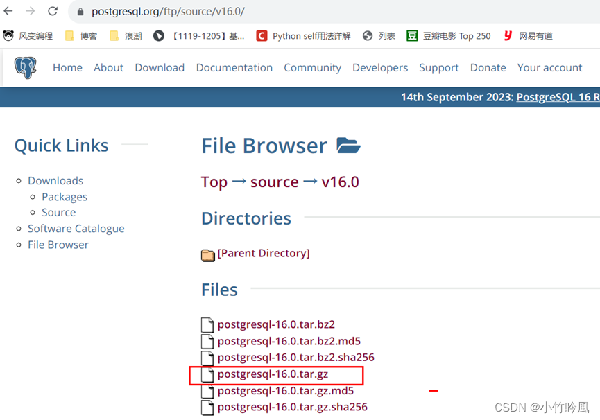
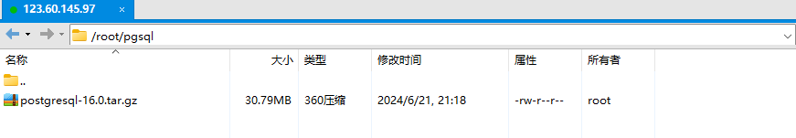
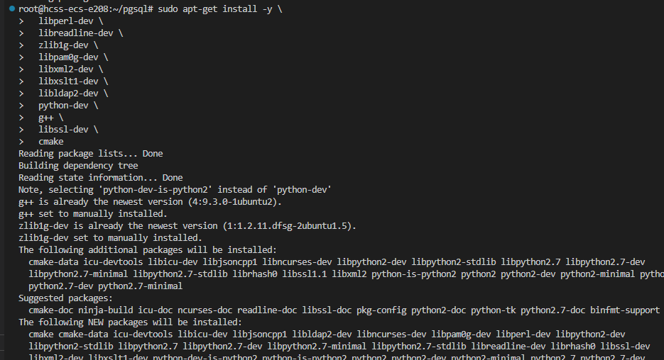
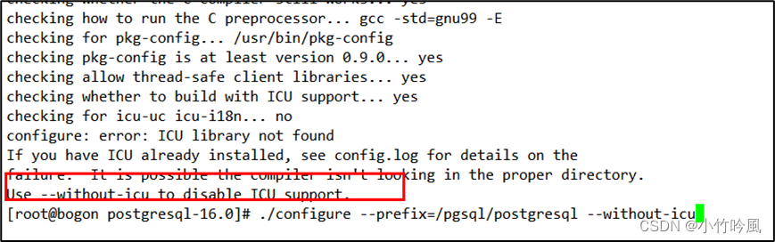
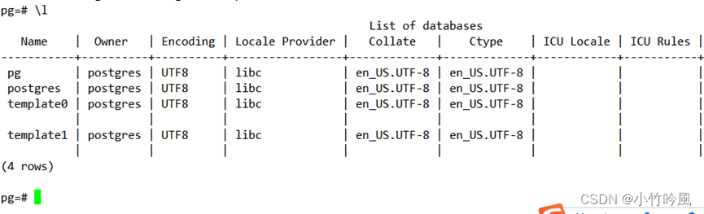

#### 一、安装环境

[操作系统](https://so.csdn.net/so/search?q=%E6%93%8D%E4%BD%9C%E7%B3%BB%E7%BB%9F&spm=1001.2101.3001.7020)：Ubuntu 20.04 server 64bit

PostgreSQL版本：16  
Firewalld关闭、selinux关闭  
笔者本次选用最新v16版本进行部署

#### 二、pg数据库安装包下载

```
下载地址：https://www.postgresql.org/ftp/source/
```



这里下载包，并上传到服务器



#### 三、安装依赖包

执行以下命令安装所需依赖包：

```
yum install -y perl-ExtUtils-Embed readline-devel zlib-devel pam-devel libxml2-devel libxslt-devel openldap-devel python-devel gcc-c++ openssl-devel cmake
```

如果你的系统是Ubuntu，你可以使用`apt-get`来安装与这些软件包相对应的包。以下是相应的命令：

```
sudo apt-get update
sudo apt-get install -y \
  libperl-dev \
  libreadline-dev \
  zlib1g-dev \
  libpam0g-dev \
  libxml2-dev \
  libxslt1-dev \
  libldap2-dev \
  python-dev \
  g++ \
  libssl-dev \
  cmake
```

这个命令将会安装与`yum`命令中相对应的所有软件包。以下是各软件包的对照：

- `perl-ExtUtils-Embed` -> `libperl-dev`
- `readline-devel` -> `libreadline-dev`
- `zlib-devel` -> `zlib1g-dev`
- `pam-devel` -> `libpam0g-dev`
- `libxml2-devel` -> `libxml2-dev`
- `libxslt-devel` -> `libxslt1-dev`
- `openldap-devel` -> `libldap2-dev`
- `python-devel` -> `python-dev`
- `gcc-c++` -> `g++`
- `openssl-devel` -> `libssl-dev`
- `cmake` -> `cmake`

确保运行这些命令时使用`sudo`，以获得必要的权限来安装软件包。



#### 四、安装postgreSQL

```
1)、在根目录下新建pgsql文件夹，并将pgsql的压缩包放入里边。
# 笔者在这里把文件夹创建到root下了，建议创建到根目录
mkdir /pgsql
[root@bogon pgsql]# ls
postgresql-16.0  postgresql-16.0.tar.gz
[root@bogon pgsql]# pwd
/root/pgsql
```

```
2）、解压压缩包
tar -zxvf postgresql-16.0.tar.gz
```

```
3）、进入加压后的文件夹
[root@bogon ~]# cd pgsql/postgresql-16.0
[root@bogon postgresql-16.0]# ls
aclocal.m4  config.log     configure     contrib    doc          GNUmakefile.in  INSTALL   meson.build        README
config      config.status  configure.ac  COPYRIGHT  GNUmakefile  HISTORY         Makefile  meson_options.txt  src
```

```
4、编译postgresql源码
./configure --prefix=/pgsql/postgresql --without-icu
```

**注意：笔者在这里碰到编译报错，由于版本比较新也没有查到相关处理方法，索性就按照提示操作，禁用icu模块支持。–without-icu**  


| 选项              | 描述                                         |
| ----------------- | -------------------------------------------- |
| –prefix=prefix    | 安装到prefix指定目录；默认为/usr/local/pgsql |
| –bindir=dir       | 安装应用程序到dir;默认为prefix/bin           |
| –with-docdir=dir  | 安装文档到dir;默认为prefix/doc               |
| –with-pgport=port | 设置默认服务端网络连接服务TCP端口号          |
| –with-tcl         | 服务端提供Tcl存储过程支持                    |
| –with-perl        | 服务端提供perl存储过程支持                   |
| –with-python      | 服务端提供Python存储过程支持                 |

```
5、编译安装
root@bogon postgresql-16.0]# make &amp;&amp; make install
编译安装结束没有报错证明安装成功；至此已完成postgresql的安装。进入/pgsql/postgresql目录可以看到安装后的postgresql文件。
[root@bogon postgresql-16.0]# cd /pgsql/postgresql/
[root@bogon postgresql]# ls
bin  include  lib  share
```

#### 五、创建用户组postgre并创建用户postgre

```
[root@bogon postgresql]# groupadd postgres
[root@bogon postgresql]# useradd -g postgres postgres
[root@bogon postgresql]# id postgres
uid=1001(postgres) gid=1001(postgres) groups=1001(postgres)
```

#### 六、创建postgresql数据库的数据主目录并修改文件所有者

数据库主目录可根据实际情况而创建，这里我们把主目录放在

```
/pgsql/postgresql/data/目录下：
[root@bogon postgresql]# mkdir data
[root@bogon postgresql]# chown postgres:postgres data
[root@bogon postgresql]# ls -al
total 16
drwxr-xr-x 7 root     root       68 Sep 19 16:23 .
drwxr-xr-x 3 root     root       24 Sep 19 16:20 ..
drwxr-xr-x 2 root     root     4096 Sep 19 16:20 bin
drwxr-xr-x 2 postgres postgres    6 Sep 19 16:23 data
drwxr-xr-x 6 root     root     4096 Sep 19 16:20 include
drwxr-xr-x 4 root     root     4096 Sep 19 16:20 lib
drwxr-xr-x 6 root     root     4096 Sep 19 16:20 share
```

#### 七、配置环境变量

```
进入home/postgre目录可以看到.bash_profile文件。
编辑修改.bash_profile文件。
[root@bogon postgres]# vi .bash_profile 

# .bash_profile

# Get the aliases and functions
if [ -f ~/.bashrc ]; then
        . ~/.bashrc
fi

# User specific environment and startup programs

PATH=$PATH:$HOME/.local/bin:$HOME/bin

export PGHOME=/pgsql/postgresql
export PGDATA=/pgsql/postgresql/data
PATH=$PATH:$HOME/bin:$PGHOME/bin
export PATH
~        


在.bash_profile文件中新增加内容如下：
export PGHOME=/pgsql/postgresql
export PGDATA=/pgsql/postgresql/data
PATH=$PATH:$HOME/bin:$PGHOME/bin
```

编辑修改.bash\_profile文件然后保存。执行以下命令，使环境变量生效  
\[root@bogon postgres\]# source .bash\_profile

#### 八、切换到postgre用户，并使用initdb初始化数据库

```
[root@bogon postgres]# su - postgres
[postgres@bogon ~]$ initdb
The files belonging to this database system will be owned by user "postgres".
This user must also own the server process.
The database cluster will be initialized with locale "en_US.UTF-8".
The default database encoding has accordingly been set to "UTF8".
The default text search configuration will be set to "english".
Data page checksums are disabled.
fixing permissions on existing directory /pgsql/postgresql/data ... ok
creating subdirectories ... ok
selecting dynamic shared memory implementation ... posix
selecting default max_connections ... 100
selecting default shared_buffers ... 128MB
selecting default time zone ... Asia/Shanghai
creating configuration files ... ok
running bootstrap script ... ok
performing post-bootstrap initialization ... ok
initdb: warning: enabling "trust" authentication for local connections
initdb: hint: You can change this by editing pg_hba.conf or using the option -A, or --auth-local and --auth-host, the next time you run initdb.
Success. You can now start the database server using:
pg_ctl -D /pgsql/postgresql/data -l logfile start
```

可以看到/pgsql/postgresql/data

```
[root@bogon opt]# cd /pgsql/postgresql/
[root@bogon postgresql]# ls
bin  data  include  lib  share
[root@bogon postgresql]# cd data/
[root@bogon data]# ls
base    pg_commit_ts  pg_hba.conf    pg_logical    pg_notify    pg_serial     pg_stat      pg_subtrans  pg_twophase  pg_wal   postgresql.auto.conf
global  pg_dynshmem   pg_ident.conf  pg_multixact  pg_replslot  pg_snapshots  pg_stat_tmp  pg_tblspc    PG_VERSION   pg_xact  postgresql.conf
```

#### 九、配置服务

```
修改/pgsql/postgresql/data/目录下的两个问价
Postgresql.conf 配置postgreSQL数据库服务的相应参数
pg_hba.conf  配置对数据库的访问权限
listen_addresses = '*'      # what IP address(es) to listen on;
# comma-separated list of addresses;
# defaults to 'localhost'; use '*' for all
# (change requires restart)
#port = 5432               # (change requires restart)
max_connections = 100                   # (change requires resta
```

> 其中，参数“listen\_addresses”表示监听的IP地址，默认是在localhost处监听，也就是127.0.0.1的IP地址上监听，只接受来自本机的localhost的连接请求，这会让远程的主机无法登陆这台数据库，如果想从其他的机器上登陆这台数据库，需要把监听地址改为实际网络的地址，一种简单的方法是，将行开头的#号去掉，把这个地址改为\*，表示在本地的所有地址上监听。

```
[root@bogon data]# vim pg_hba.conf
找到最下面这一行，这样局域网的人才能访问，红色为新添加内容。
# IPv4 local connections:
host    all      all             0.0.0.0/0               trust
host    all     all             127.0.0.1/32            trust
``
pg_hba.conf文件新增内容如下：
host    all      all             0.0.0.0/0               trust

```

#### 十、设置postgresql开机自启动

PostgreSQL的开机自启动脚本位于postgreSQL源码目录的contrib/start-scripts路径下。  
[Linux](https://so.csdn.net/so/search?q=Linux&spm=1001.2101.3001.7020)文件即为Linux系统上的启动脚本

```
[root@bogon start-scripts]# pwd
/root/pgsql/postgresql-16.0/contrib/start-scripts
[root@bogon start-scripts]# ls
freebsd  linux  macos
1）切换为root用户，修改Linux文件属性，添加X属性
[root@bogon start-scripts]# chmod a+x linux
2）复制Linux文件到/etc/init.d目录下，更名为postgresql
[root@bogon start-scripts]# cp linux /etc/init.d/postgresql
3）修改/etc/init.d/postgresql文件的两个变量
Prefix设置为postgresql的安装路径：/pgsql/postgresql
PGDATA设置为postgresql的数据目录路径："/pgsql/postgresql/data"
4）设置postgresql服务开启自启动
[root@bogon start-scripts]# chkconfig --add postgresql
查看开机自启服务设置成功
[root@bogon start-scripts]# chkconfig 
postgresql     0:off1:off2:on3:on4:on5:on6:off
5)执行service postgresql start，启动postgreSQL服务
[root@bogon start-scripts]# service postgresql start
Starting PostgreSQL: ok
查看postgresql服务监听
[root@bogon start-scripts]# ps -elf |grep postgres
4 S root      17527   7286  0  80   0 - 47969 do_wai 16:26 pts/0    00:00:00 su - postgres
4 S postgres  17528  17527  0  80   0 - 28886 n_tty_ 16:26 pts/0    00:00:00 -bash
0 S postgres  17653      1  0  80   0 - 68572 ep_pol 16:35 ?        00:00:00 /pgsql/postgresql/bin/postgres -D /pgsql/postgresql/data
1 S postgres  17654  17653  0  80   0 - 68607 ep_pol 16:35 ?        00:00:00 postgres: checkpointer 
1 S postgres  17655  17653  0  80   0 - 68605 ep_pol 16:35 ?        00:00:00 postgres: background writer 
1 S postgres  17657  17653  0  80   0 - 68605 ep_pol 16:35 ?        00:00:00 postgres: walwriter 
1 S postgres  17658  17653  0  80   0 - 68974 ep_pol 16:35 ?        00:00:00 postgres: autovacuum launcher 
1 S postgres  17659  17653  0  80   0 - 68969 ep_pol 16:35 ?        00:00:00 postgres: logical replication launcher 
0 S root      17663  17574  0  80   0 - 28202 pipe_w 16:36 pts/1    00:00:00 grep --color=auto postgres
```

#### 十一、开始测试

```
[root@bogon postgres]# su – postgres
[postgres@bogon ~]$ psql
```

1． 创建数据库用户  
2． 赋予账号权限  
3． 新建数据库  
4． 退出

```
postgres=# create user pg password 'pg';
CREATE ROLE
postgres=# ALTER ROLE pg SUPERUSER;
ALTER ROLE
postgres=# create database pg;
CREATE DATABASE
postgres=# \q
```

1.  重新登陆数据库
2.  输入密码
3.  显示数据库

```
[postgres@bogon ~]$ psql -U pg -d pg -h 192.168.0.244
pg=# \l
                         List of databases
 Name    |  Owner   | Encoding | Locale Provider |   Collate   |    Ctype    | ICU Locale | ICU Rules |   Access privileges   
-----------+----------+----------+-----------------+----- 
```

  
至此数据库安装成功。