参考：

[PostgreSQL16源码包编译安装_postgresql16安装-CSDN博客](https://blog.csdn.net/wang_xiangjun/article/details/133122868?ops_request_misc=&request_id=&biz_id=102&utm_term=postgresql源码包安装&utm_medium=distribute.pc_search_result.none-task-blog-2~all~sobaiduweb~default-4-133122868.142^v100^pc_search_result_base5&spm=1018.2226.3001.4187)

[Ubuntu环境PostgreSQL源码编译安装_ubuntu 编译安装pgsql-CSDN博客](https://blog.csdn.net/twi_twi/article/details/127146765?ops_request_misc=%7B%22request%5Fid%22%3A%22171897831116800225554838%22%2C%22scm%22%3A%2220140713.130102334.pc%5Fall.%22%7D&request_id=171897831116800225554838&biz_id=0&utm_medium=distribute.pc_search_result.none-task-blog-2~all~first_rank_ecpm_v1~hot_rank-3-127146765-null-null.142^v100^pc_search_result_base5&utm_term=postgresql源码包安装ubuntu&spm=1018.2226.3001.4187)

[Ubuntu源码安装配置PostgreSQL_postgres:x:1001:-CSDN博客](https://blog.csdn.net/qq_53237618/article/details/134820792?ops_request_misc=%7B%22request%5Fid%22%3A%22171897831116800225554838%22%2C%22scm%22%3A%2220140713.130102334.pc%5Fall.%22%7D&request_id=171897831116800225554838&biz_id=0&utm_medium=distribute.pc_search_result.none-task-blog-2~all~first_rank_ecpm_v1~hot_rank-9-134820792-null-null.142^v100^pc_search_result_base5&utm_term=postgresql源码包安装ubuntu&spm=1018.2226.3001.4187)

第一次安装不小心安装到了root目录下，发现配置环境变量和在切换postgres用户后，会导致postgres用户下无法找到postgresql/bin目录下的命令，所以以第二次实操为正确操作，来实现安装。

### 一、pg数据库安装包下载

下载地址：[http://www.postgresql.org/ftp/source/](http://www.postgresql.org/ftp/source/)  
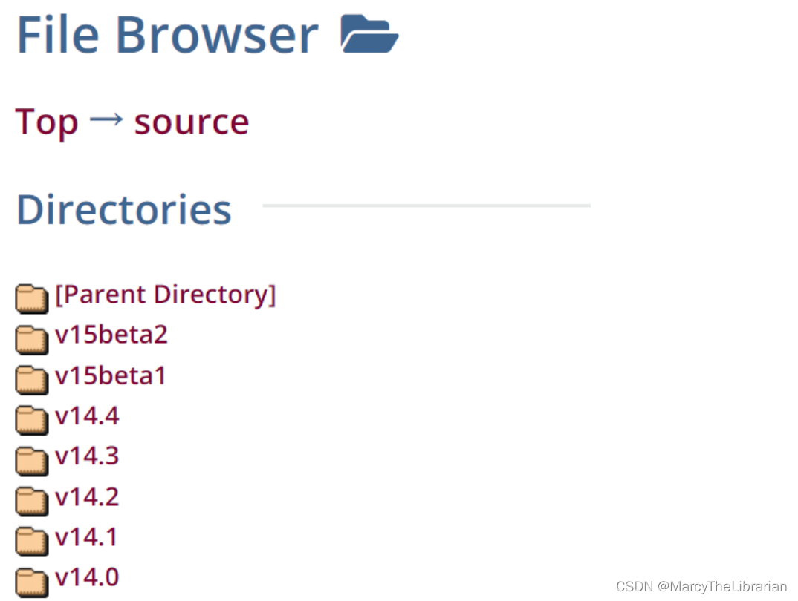  
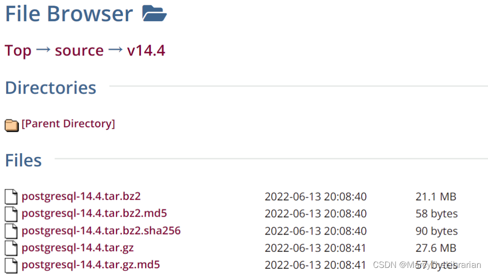

这里我安装的是16.0

### 二、安装依赖包

```bash
sudo apt-cache search readline
sudo apt install lib64readline8 lib64readline-dev 
sudo apt install zlib1g-dev
sudo apt install gcc
sudo apt install  libreadline6-dev
sudo apt install make
```

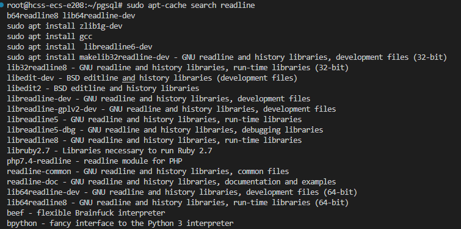

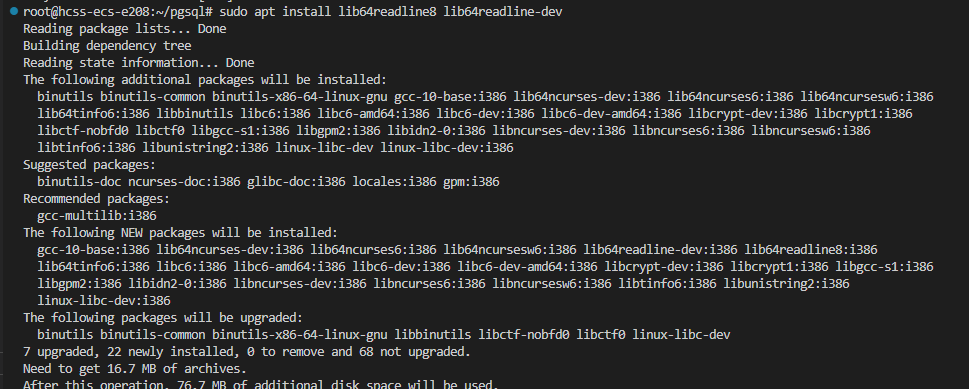


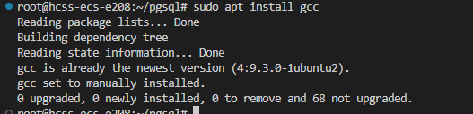

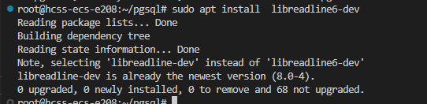

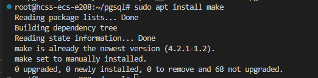

### 三、安装postgres

进入/opt目录，新建两个包，其中software放压缩包，module放解压和安装后的软件

```
[root@localhost opt]# mkdir software
[root@localhost opt]# mkdir module
```

然后加入到software中，将下载下来的压缩包传上去

```
[root@localhost opt]# cd software
```

然后解压缩

```
[root@localhost software]# tar -zxvf postgresql-14.4.tar.gz 
```

然后将解压缩得到的[postgresql](https://so.csdn.net/so/search?q=postgresql&spm=1001.2101.3001.7020)\-14.4移动到module中

```
[root@localhost software]# cd  /opt/module/postgresql-14.4
```

进入postgresql-14.4

```
[root@localhost software]# cd  /opt/module/postgresql-14.4
```

编译postgresql源码，报错

```
[root@localhost postgresql-14.4]# ./configure --prefix=/opt/module/pgsql
```

  
再先后执行make和make install

```
<span class="token punctuation">[</span>root@localhost postgresql-14.4<span class="token punctuation">]</span><span class="token comment"># make</span>
<span class="token punctuation">[</span>root@localhost postgresql-14.4<span class="token punctuation">]</span><span class="token comment"># make install</span>
<div class="hljs-button {2}" data-title="复制"></div>
```

#### 实操

直接建立一个文件夹PGSQL，然后压缩包放进去

解压

tar -zxvf postgresql-16.0.tar.gz 

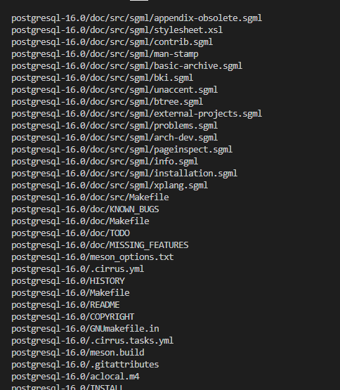

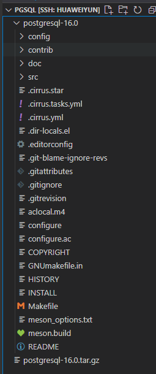

进入目录

cd postgresql-16.0

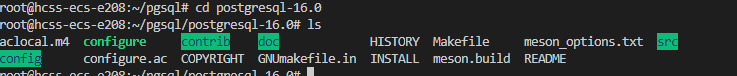

编译源码使用的是以下命令，但是我这里也是创建到了root目录下可能不对

```
4、编译postgresql源码
./configure --prefix=/pgsql/postgresql --without-icu
./configure --prefix=/root/pgsql/postgresql --without-icu 
```

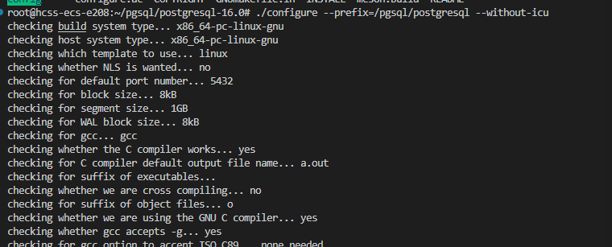

换成这种

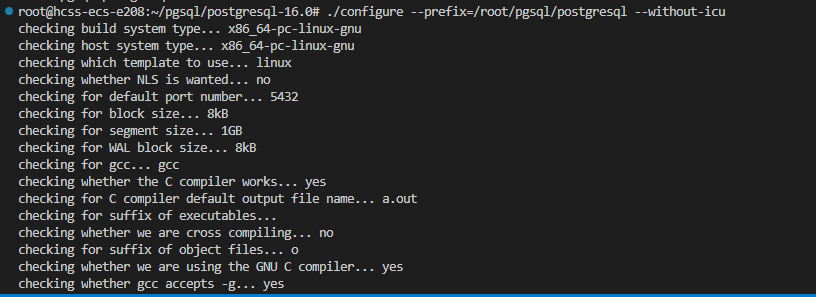

编译安装 make && make install

```
5、编译安装
root@bogon postgresql-16.0]# make && make install
编译安装结束没有报错证明安装成功；至此已完成postgresql的安装。进入/pgsql/postgresql目录可以看到安装后的postgresql文件。
[root@bogon postgresql-16.0]# cd /root/pgsql/postgresql/
[root@bogon postgresql]# ls
bin  include  lib  share
```

没有报错

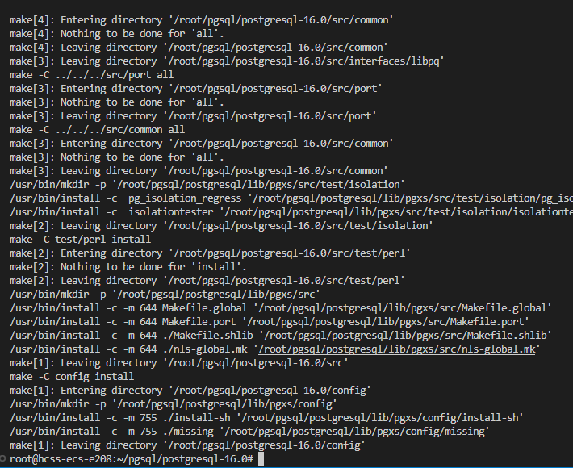


#### 第二次实操

这次不建立在root下，而是建立在根目录下

```
tar -zxvf postgresql-16.0.tar.gz 
cd postgresql-16.0
./configure --prefix=/pgsql/postgresql --without-icu
make && make install
cd ..
cd postgresql
ls
```

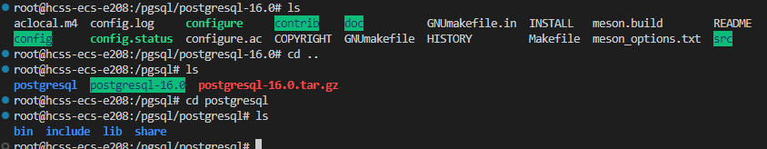

### 四、添加用户

如果执行失败，添加sudo试下

```
useradd -m -d /home/postgres -s /bin/bash postgres

```

修改postgres用户的密码

```
passwd postgres

```

#### 实操

创建用户组postgre并创建用户postgre

```
[root@bogon postgresql]# groupadd postgres
[root@bogon postgresql]# useradd -g postgres postgres
[root@bogon postgresql]# id postgres
uid=1001(postgres) gid=1001(postgres) groups=1001(postgres)
```

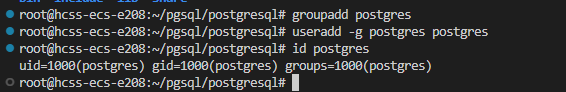

密码改为postgres

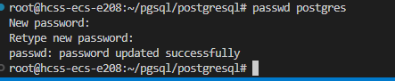

#### 补充：

在PostgreSQL源码安装过程中，创建一个用户组`postgre`和一个用户`postgre`有以下几个目的：

1. 安全性：
   - 将PostgreSQL运行在一个专用的用户账户下可以增强系统的安全性。这样，即使数据库服务被攻破，攻击者也只会获得该用户的权限，而不是整个系统的权限。
2. 权限管理：
   - 专用的用户账户可以帮助更好地管理文件和目录的权限。只有`postgre`用户会有权访问、修改和管理数据库文件，这防止了其他用户意外或恶意地更改数据库文件。
3. 进程隔离：
   - 通过使用专用的用户账户，PostgreSQL进程可以与系统中的其他进程隔离开来。这种隔离可以提高系统的稳定性和安全性。

### 创建用户组和用户的步骤

以下是如何在Linux系统上创建一个用户组`postgre`和用户`postgre`的步骤：

1. **创建用户组**：

   ```
   sudo groupadd postgre
   ```

2. **创建用户并添加到用户组**：

   ```
   sudo useradd -g postgre -m -s /bin/bash postgre
   ```

3. **为用户设置密码**：

   ```
   sudo passwd postgre
   ```

### 五、创建postgresql数据库的数据主目录并修改文件所有者

```
[root@localhost postgresql-14.4]# cd /opt/module/pgsql/
[root@localhost pgsql]# ls
bin  include  lib  share
[root@localhost pgsql]# mkdir data
[root@localhost pgsql]# chown postgres:postgres data
[root@localhost pgsql]# ls
bin  data  include  lib  share

```

#### 实操

数据库主目录可根据实际情况而创建，这里我们把主目录放在

```
/root/pgsql/postgresql/data/目录下：
[root@bogon postgresql]# mkdir data
[root@bogon postgresql]# chown postgres:postgres data
[root@bogon postgresql]# ls -al
total 16
drwxr-xr-x 7 root     root       68 Sep 19 16:23 .
drwxr-xr-x 3 root     root       24 Sep 19 16:20 ..
drwxr-xr-x 2 root     root     4096 Sep 19 16:20 bin
drwxr-xr-x 2 postgres postgres    6 Sep 19 16:23 data
drwxr-xr-x 6 root     root     4096 Sep 19 16:20 include
drwxr-xr-x 4 root     root     4096 Sep 19 16:20 lib
drwxr-xr-x 6 root     root     4096 Sep 19 16:20 share

```

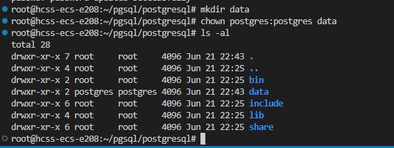

#### 初始化用户

```
# 创建postgres文件夹
sudo mkdir /home/postgres
# 设置权限
sudo chmod 755 /home/postgres
chown postgres:postgres /home/postgres

# 初始化
sudo cp -a /etc/skel/. /home/postgres
vi /etc/passwd
# 最后一行为postgres:x:1001:1001::/home/postgres:/bin/sh
# 将sh修改为bash
postgres:x:1001:1001::/home/postgres:/bin/bash

```

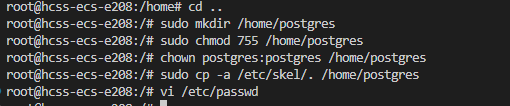

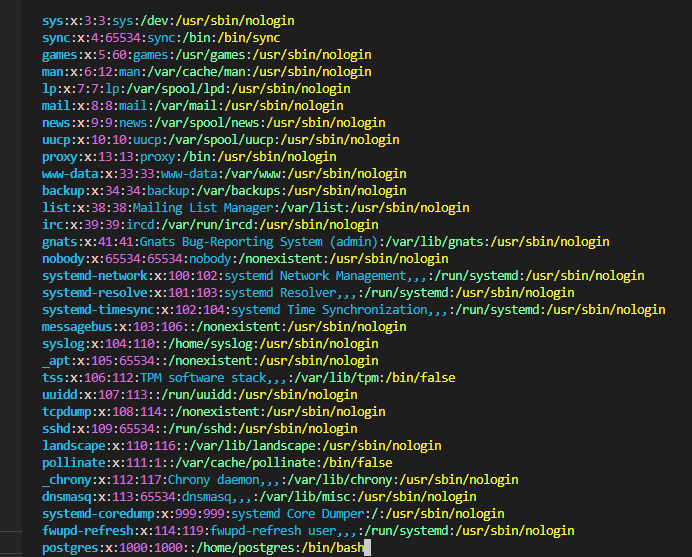

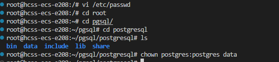

#### 第二次实操

```
root@hcss-ecs-e208:/pgsql/postgresql# mkdir data
chown postgres:postgres data
ls
# 创建postgres文件夹
sudo mkdir /home/postgres
# 设置权限
sudo chmod 755 /home/postgres
chown postgres:postgres /home/postgres

# 初始化
sudo cp -a /etc/skel/. /home/postgres
vi /etc/passwd
# 最后一行为postgres:x:1001:1001::/home/postgres:/bin/sh
# 将sh修改为bash
postgres:x:1001:1001::/home/postgres:/bin/bash

```


### 六、配置环境变量

配置环境变量（注意，这里的路径要改为你的安装路径，即configure --prefix=PATH 中PATH的路径）

```
export PGHOME=/opt/module/pgsql
export PGDATA=/opt/module/pgsql/data
export PGPORT=5432
export PGUSER=postgres
export PATH=$PGHOME/bin:$PATH:$HOME/bin
export LD_LIBRARY_PATH=/opt/module/pgsql/lib

```

#### 实操

```
进入home/postgre目录可以看到.bash_profile文件。
编辑修改.bash_profile文件。
[root@bogon postgres]# vi .bash_profile 

# .bash_profile

# Get the aliases and functions
if [ -f ~/.bashrc ]; then
        . ~/.bashrc
fi

# User specific environment and startup programs

PATH=$PATH:$HOME/.local/bin:$HOME/bin

export PGHOME=/pgsql/postgresql
export PGDATA=/pgsql/postgresql/data
PATH=$PATH:$HOME/bin:$PGHOME/bin
export PATH
~        


在.bash_profile文件中新增加内容如下：
export PGHOME=/pgsql/postgresql
export PGDATA=/pgsql/postgresql/data
PATH=$PATH:$HOME/bin:$PGHOME/bin

```

```
# 编辑修改.bash_profile文件
vi /home/postgres/.bash_profile

```

==ubuntu下没看见这个目录，我准备直接修改环境变量==

```
sudo vi /etc/profile

# PostsQL
export PGHOME=/root/pgsql/postgresql
export PGDATA=/root/pgsql/postgresql/data
export PATH=$PGHOME/bin:$PATH
export LD_LIBRARY_PATH=$PGHOME/lib

```


第二次修改为

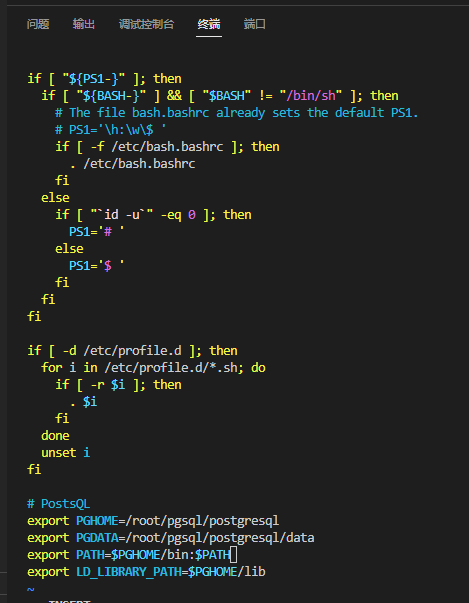

重新加载系统环境变量

```
source /etc/profile
```

安装失败，我发现是安装目录不能是root下。

#### 第二次实操

```
sudo vi /etc/profile
```

```
export PGHOME=/pgsql/postgresql
export PGDATA=/pgsql/postgresql/data
export PGPORT=5432
export PGUSER=postgres
export PATH=$PATH:$HOME/bin:$PGHOME/bin
export LD_LIBRARY_PATH=/pgsql/postgresql/lib
```

```
source /etc/profile
```

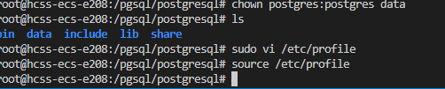


### 七、切换用户到postgres并使用initdb初使用化数据库

```
[root@localhost postgres]# su - postgres
Last login: Thu Aug  4 22:16:27 PDT 2022 on pts/0
[postgres@localhost ~]$ initdb
The files belonging to this database system will be owned by user "postgres".
This user must also own the server process.

The database cluster will be initialized with locale "en_US.UTF-8".
The default database encoding has accordingly been set to "UTF8".
The default text search configuration will be set to "english".

Data page checksums are disabled.

fixing permissions on existing directory /opt/module/pgsql/data ... ok
creating subdirectories ... ok
selecting dynamic shared memory implementation ... posix
selecting default max_connections ... 100
selecting default shared_buffers ... 128MB
selecting default time zone ... America/Los_Angeles
creating configuration files ... ok
running bootstrap script ... ok
performing post-bootstrap initialization ... ok
syncing data to disk ... ok

initdb: warning: enabling "trust" authentication for local connections
You can change this by editing pg_hba.conf or using the option -A, or
--auth-local and --auth-host, the next time you run initdb.

Success. You can now start the database server using:

    pg_ctl -D /opt/module/pgsql/data -l logfile start


```

可以看到/opt/module/[pgsql](https://so.csdn.net/so/search?q=pgsql&spm=1001.2101.3001.7020)/data中已经有数据了

```
[postgres@localhost data]$ ls
base          pg_ident.conf  pg_serial     pg_tblspc    postgresql.auto.conf
global        pg_logical     pg_snapshots  pg_twophase  postgresql.conf
pg_commit_ts  pg_multixact   pg_stat       PG_VERSION   test.txt
pg_dynshmem   pg_notify      pg_stat_tmp   pg_wal
pg_hba.conf   pg_replslot    pg_subtrans   pg_xact

```

#### 实操

```
su - postgres
initdb
```

成功

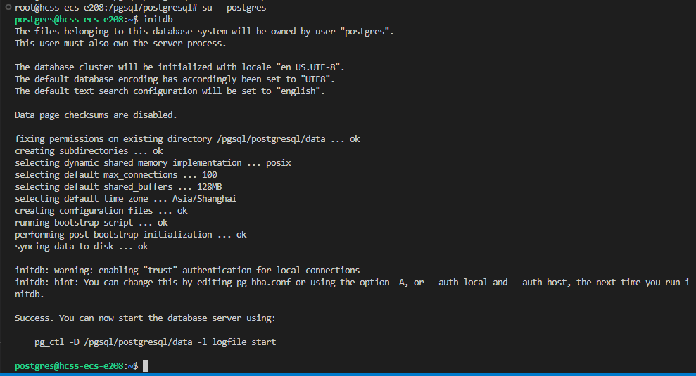

返回root用户，可以看到data目录下已经被初始化，已经有数据了

```
exit
cd /pgsql/postgresql/data
ls
```

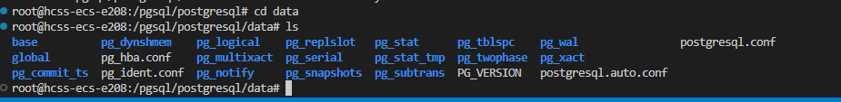

### 八、配置服务

修改/opt/module/pgsql/data目录下的两个文件。  
postgresql.conf 配置PostgreSQL数据库服务器的相应的参数。  
pg\_hba.conf 配置对数据库的访问权限。

```
[postgres@localhost data]$ vim postgresql.conf 

```

```
其中，参数“listen_addresses”表示监听的IP地址，默认是在localhost处监听，也就是127.0.0.1的IP地址上监听，只接受来自本机的localhost的连接请求，这会让远程的主机无法登陆这台数据库，如果想从其他的机器上登陆这台数据库，需要把监听地址改为实际网络的地址，一种简单的方法是，将行开头的#号去掉，把这个地址改为*，表示在本地的所有地址上监听。
```

将listen\_addresses和port前的注释去掉，并修改listen\_addresses的值为\*

```
#------------------------------------------------------------------------------
# CONNECTIONS AND AUTHENTICATION
#------------------------------------------------------------------------------

# - Connection Settings -

listen_addresses = '*'          # what IP address(es) to listen on;
                                        # comma-separated list of addresses;
                                        # defaults to 'localhost'; use '*' for all
                                        # (change requires restart)
port = 5432                             # (change requires restart)
max_connections = 100                   # (change requires restart)
#superuser_reserved_connections = 3     # (change requires restart)
#unix_socket_directories = '/tmp'       # comma-separated list of directories

```

在[IPv4](https://so.csdn.net/so/search?q=IPv4&spm=1001.2101.3001.7020)中添加一条语句

```
vim pg_hba.conf
# IPv4 local connections:
host    all             all             0.0.0.0/0               trust
host    all             all             127.0.0.1/32            trust
```

### 实操

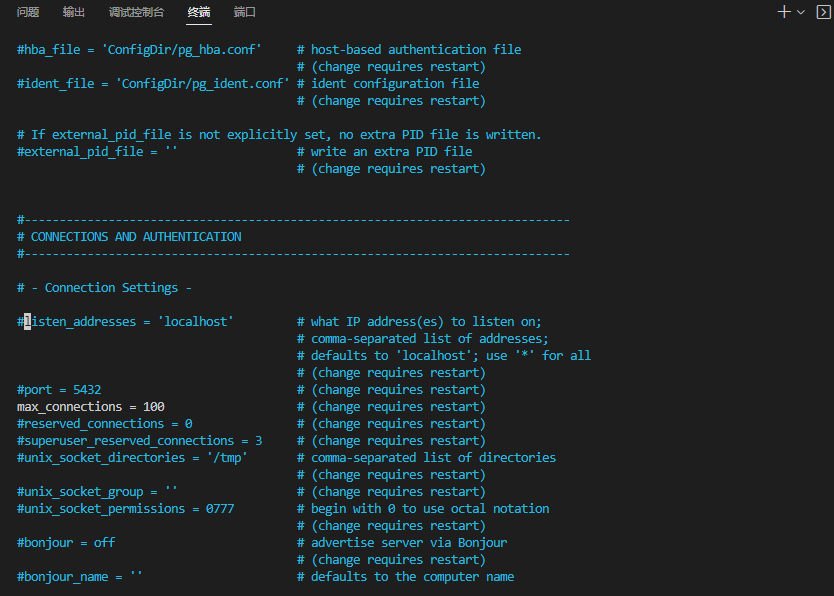

去掉listen和port注释,并将地址修改为*

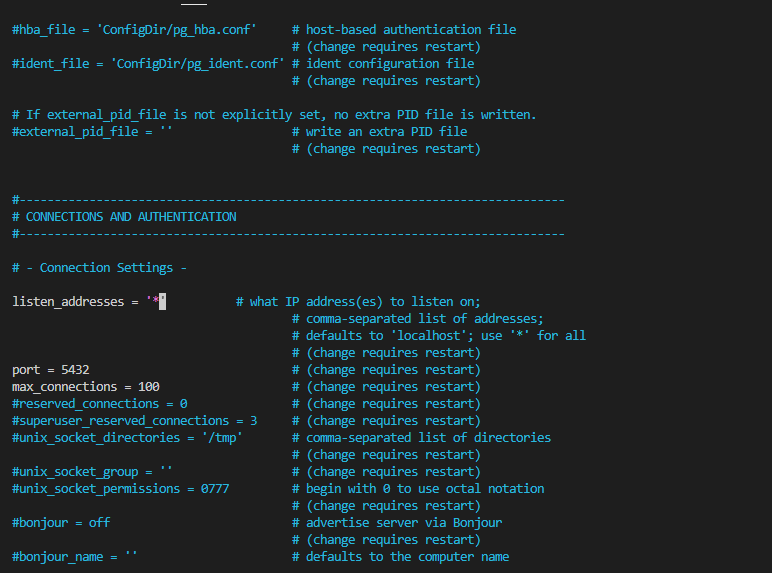

vim pg_hba.conf

添加一行，这样局域网的人才能访问，红色为新添加内容。

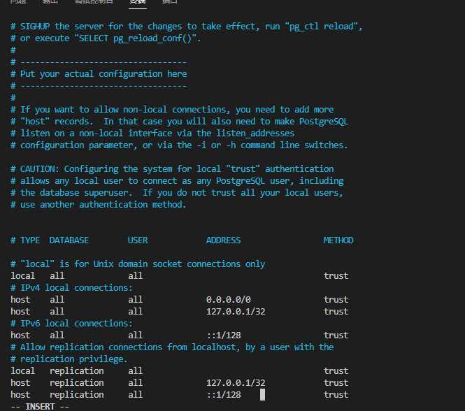

### 九、设置PostgreSQL开机自启动

找到postgresql-14.4

```
[postgres@localhost postgresql-14.4]$ pwd
/opt/module/postgresql-14.4

```

```
[postgres@localhost postgresql-14.4]$ cd contrib/start-scripts/
[postgres@localhost start-scripts]$ ls
freebsd  linux  macos

```

切换为root用户

```
[root@localhost start-scripts]# chmod a+x linux
[root@localhost start-scripts]# cp linux /etc/init.d/postgresql

```

修改/etc/init.d/postgresql文件的两个变量

```
# Installation prefix
prefix=/opt/module/pgsql

# Data directory
PGDATA="/opt/module/pgsql/data"

```

设置postgresql服务开机自启动

```
[root@localhost init.d]# chkconfig --add postgresql
[root@localhost init.d]# chkconfig
...
postgresql     	0:off	1:off	2:on	3:on	4:on	5:on	6:off

```

然后将5432端口开启（或直接把防火墙给关了）

```
sudo ufw allow 5432/tcp

```

执行service postgresql start，启动PostgreSQL服务

```
[root@localhost init.d]# service postgresql start
Starting PostgreSQL: ok

```

#### 实操

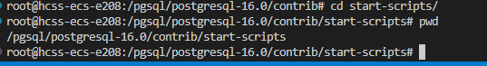


```
[root@bogon start-scripts]# pwd
/root/pgsql/postgresql-16.0/contrib/start-scripts
[root@bogon start-scripts]# ls
freebsd  linux  macos
1）	切换为root用户，修改Linux文件属性，添加X属性
[root@bogon start-scripts]# chmod a+x linux
2）	复制Linux文件到/etc/init.d目录下，更名为postgresql
[root@bogon start-scripts]# cp linux /etc/init.d/postgresql
3）	修改/etc/init.d/postgresql文件的两个变量
Prefix设置为postgresql的安装路径：/pgsql/postgresql
PGDATA设置为postgresql的数据目录路径："/pgsql/postgresql/data"
4）	设置postgresql服务开启自启动
[root@bogon start-scripts]# chkconfig --add postgresql
查看开机自启服务设置成功
[root@bogon start-scripts]# chkconfig 
postgresql     	0:off	1:off	2:on	3:on	4:on	5:on	6:off
5)执行service postgresql start，启动postgreSQL服务
[root@bogon start-scripts]# service postgresql start
Starting PostgreSQL: ok
查看postgresql服务监听
[root@bogon start-scripts]# ps -elf |grep postgres
4 S root      17527   7286  0  80   0 - 47969 do_wai 16:26 pts/0    00:00:00 su - postgres
4 S postgres  17528  17527  0  80   0 - 28886 n_tty_ 16:26 pts/0    00:00:00 -bash
0 S postgres  17653      1  0  80   0 - 68572 ep_pol 16:35 ?        00:00:00 /pgsql/postgresql/bin/postgres -D /pgsql/postgresql/data
1 S postgres  17654  17653  0  80   0 - 68607 ep_pol 16:35 ?        00:00:00 postgres: checkpointer 
1 S postgres  17655  17653  0  80   0 - 68605 ep_pol 16:35 ?        00:00:00 postgres: background writer 
1 S postgres  17657  17653  0  80   0 - 68605 ep_pol 16:35 ?        00:00:00 postgres: walwriter 
1 S postgres  17658  17653  0  80   0 - 68974 ep_pol 16:35 ?        00:00:00 postgres: autovacuum launcher 
1 S postgres  17659  17653  0  80   0 - 68969 ep_pol 16:35 ?        00:00:00 postgres: logical replication launcher 
0 S root      17663  17574  0  80   0 - 28202 pipe_w 16:36 pts/1    00:00:00 grep --color=auto postgres

```

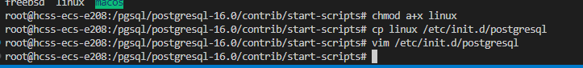

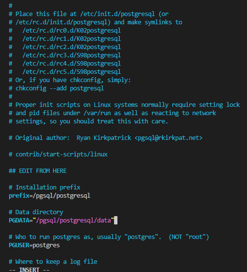

设置开机自启动，ubuntu下是

```
sudo systemctl enable postgresql
```

还是不行，补充资料

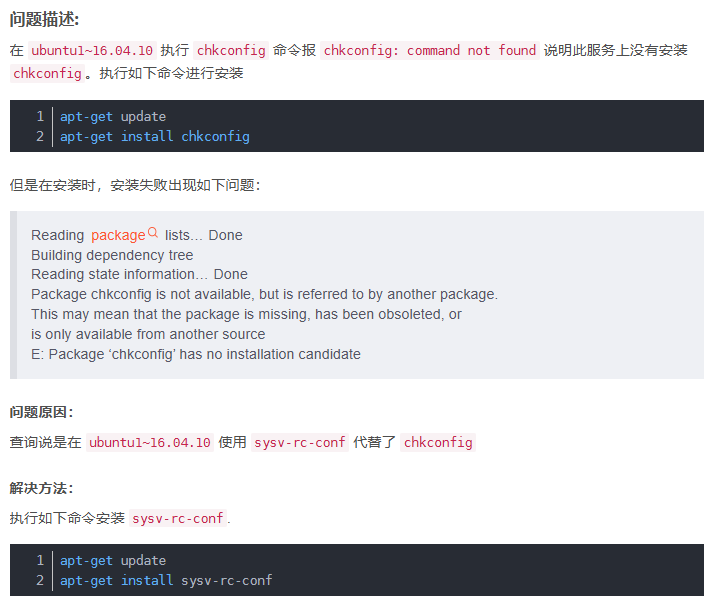

还是不行，参考

[一个解决linux系统下没有chkconfig命令导致的command not found: chkconfig问题_chkconfig: command not found-CSDN博客](https://blog.csdn.net/wildwolf_001/article/details/115250102?ops_request_misc=%7B%22request%5Fid%22%3A%22171915015916800185859996%22%2C%22scm%22%3A%2220140713.130102334..%22%7D&request_id=171915015916800185859996&biz_id=0&utm_medium=distribute.pc_search_result.none-task-blog-2~all~baidu_landing_v2~default-3-115250102-null-null.142^v100^pc_search_result_base5&utm_term=chkconfig%3A command not found&spm=1018.2226.3001.4187)


### 十、开始测试

默认的用户是postgres，密码和linux系统中所设的postgres用户的密码一样

```
[root@localhost init.d]# su - postgres
Last login: Thu Aug  4 23:08:40 PDT 2022 on pts/0
[postgres@localhost ~]$ psql
psql (14.4)
Type "help" for help.

postgres=# 

```


### 总的来说安装失败了，无法启动pgsql，后面切换系统为centos