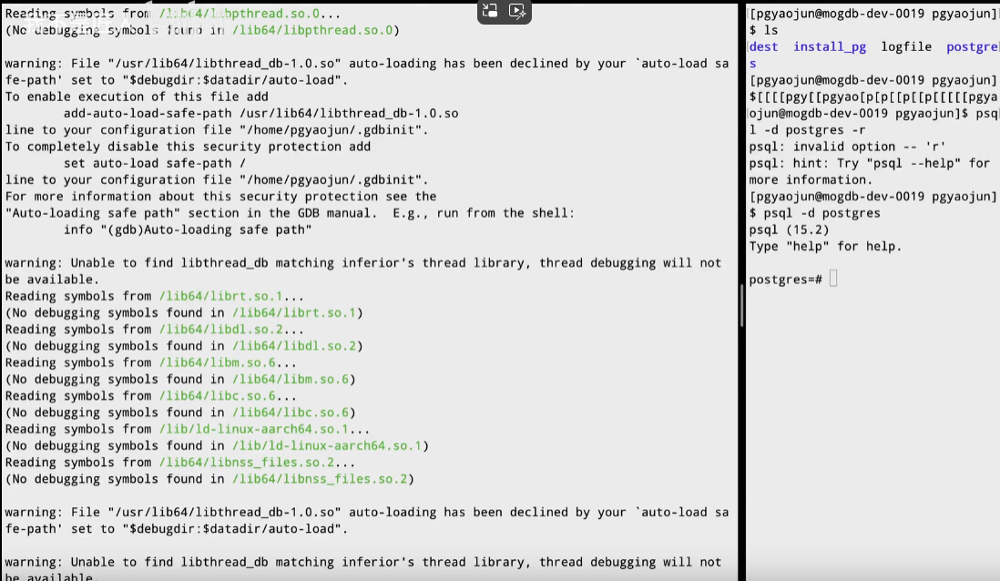
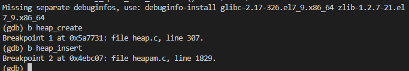

# 【PostgreSQL源码解析】GDB调试和PG缓冲池分享

## 一、GDB常用命令

```
gdb attach pid #关联进程
gdb -p pid #关联进程
set args name 18 #设置参数
b test.c:9 #根据文件名称+行数 设置断点
b funcName #根据函数名称 设置断点
info breakpoints #查看断点
d breakNumber #删除断点
```

实际调试常用的命令

```
r #运行
c #继续执行
q #退出
s #进入
n #下一步
p blockNum #打印数据
layout src #显示源码
```

gdb屏蔽信号

```
# vim ~/.gdbinit
handle SIGUSR1 noprint nostop
handle SIGUSR2 noprint nostop
set pagination off
```


## 二、Linux命令

一个文件改为一个用户专属的

```
chown yao:yao /tmp/data -R #更改用户和组
chmod 755 /data #更改权限 111 101 101  101：可读不可写
uesradd yao #增加用户
userdel yao #删除用户

```


```
lsblk #查看设备
mount /dev/vdb /data #挂载/dev/vdb磁盘到/data目录
cat /etc/os-release #查看系统配置
ps aux | grep postgres #查看指定进程
```

如果有挂载，可以从mountpoint看到挂载到哪里了


## 三、gdb调试pg源码

先起一个终端，使用命令查看进程

```
ps aux | grep postgres
```

再切换一个终端，切换用户，登录到pgsql中，然后再使用ps aux | grep postgres来查看进程号

这个进程就是我们需要使用gdb跟踪的


使用

```
gdb attach + 进程号pid
```

安装gdb的命令

```
yum install -y gdb
```




创建断点，比如利用函数名打断点，例如在pg缓冲池的创建函数打断点

```
b heap_create
```

插入数据时打断点

```
b heap_insert
```



让进程运行起来，给命令c

```
c
```

切换到另一个终端，进行一个数据库的数据插入操作

由于没有数据库，这里先创建一个数据库

```
CREATE DATABASE tb;

```


还没有插入数据时，就已经进入断点了

```
insert into tb values(1314);
```


在heap_insert停住了，使用命令，查看源码

```
layout src
```


然后使用单步调试来进行

```
n
n
n
```

通过阅读源码知道，这里因为我们插入数据库或者插入数据，首先它要去找一个页面去做插入，首先要去做一个准备


我们使用s命令，进入到函数RelationGetBufferForTuple中去

```
s
```

这是在做一些初始化页面这些操作


按过n后，可以直接按回车进行上一次的操作

```
n
```

观察到这里有很多readbuffer函数，去从缓冲区去拿页面，可能之前已经从磁盘上拿到了缓冲池，所以这里直接返回


后面就是检查一些页面的可见性

我们这里不继续看了，直接c命令让他继续执行

```
c
```

再插入一个，就还是停在之前的端点


我们gdb中，调用栈是最重要看的，使用命令bt

```
bt
后面加数字，就是最近的n条调用栈
bt 4
```


当然是从下往上看了，是从table_tuple_insert最后到heap_insert()，可以看到调用关系

最后，调试结束，就q退出了

```
q
```

