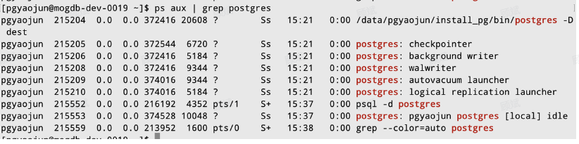

PostgreSQL15源码安装教程

### 一、简介

PostgreSQL简称为PG，是一个多进程模型。

### 二、源码编译安装

也可以从gitee上下载，可能速度要快一些。

- [Github代码](https://github.com/postgres/postgres)

- [参考博客](https://blog.csdn.net/weixin_40326748/article/details/128753725)

- pg默认端口是5432


- postgresql.conf


#### 1.下载代码

```
#git clone https://github.com/postgres/postgres.git
# 使用码云加速下载
git clone https://gitee.com/mirrors/PostgreSQL.git
cd postgres
# 切换发行版分支
git checkout REL_15_STABLE
```

#### 2.安装

```
# 安装pg_15
cd postgres
./configure  --enable-debug  --enable-cassert --prefix=/data/yaojun/install_pkg/pg CFLAGS=-O0 --without-icu
make -j 16
make install
```

#### 3.配置环境变量

```
# 环境变量 vim  ~/.bashrc
export PATH=/data/yaojun/install_pkg/pg/bin:$PATH
# 刷新环境变量
source ~/.bashrc
```

#### 4.初始化

```
# 初始化，dest目录没有会自动创建
initdb -D dest
```

#### 5.启动

```
# 启动
pg_ctl start -D dest
# 进入客户端
# -d是指定数据库名称 如果不指定默认是以当前用户名作为数据库名
psql -d postgres -p5432  

```

## 三、后台进程

1.postgres

2.checkpointer

3.background writer

4.walwriter

5.autovacuum launcher

6.logical replication launcher



先进入客户端才能看到local

## 四、GDB调试

- 设置环境变量 vim ~/.gdbinit

```
handle SIGUSR1 noprint nostop
handle SIGUSR2 noprint nostop
set pagination off
```

SQL

复制


•

查询后台进程ID


SQL

复制


Plain Text

复制

gdb attach pid -tui


六、注意

•

config出错的时候，有可能需要加上\--without-icu


C++

复制

./configure --enable-debug --enable-cassert --prefix=/data/yaojun/pg/pg\_install CFLAGS=-O0 --without-icu


•

beta\_16


SQL

复制

\# PG\_16\_beta

git checkout \-b REL\_16\_BETA1

./configure \--enable-debug --enable-cassert \--prefix=/Users/yaojun/MyInstall/pg\_install CFLAGS=-O0 --without-icu


•

其他


C++

复制

pg\_ctl -D dest -l logfile start


•

环境变量未生效


C++

复制

\# 可能不需要

export LD\_LIBRARY\_PATH=$LD\_LIBRARY\_PATH:/data/pgyaojun/install\_pg/lib

export PATH


•

使用默认端口


PG不支持-r参数


C++

复制

\# 使用默认端口

psql -d postgres


•

启动服务器


C++

复制

pg\_ctl start -D pg\_data