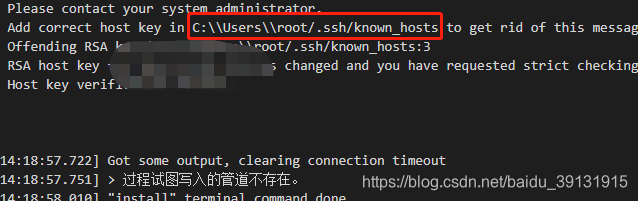

云服务器 ubuntu20.04 切换 镜像 到Centos7.9后，vscode远程连接报错


-   vscode报如下错误

```
[14:18:57.722] Got some output, clearing connection timeout
[14:18:57.751] &gt; 过程试图写入的管道不存在。
[14:18:58.010] "install" terminal command done
[14:18:58.011] Install terminal quit with output: 过程试图写入的管道不存在。
[14:18:58.011] Received install output: 过程试图写入的管道不存在。
[14:18:58.012] Failed to parse remote port from server output
[14:18:58.015] Resolver error: Error: 
at Function.Create (c:\Users\root\.vscode\extensions\ms-vscode-remote.remote-ssh-0.65.4\out\extension.js:1:64641)
at Object.t.handleInstallOutput (c:\Users\root\.vscode\extensions\ms-vscode-remote.remote-ssh-0.65.4\out\extension.js:1:63284)
at Object.t.tryInstall (c:\Users\root\.vscode\extensions\ms-vscode-remote.remote-ssh-0.65.4\out\extension.js:1:413984)
at processTicksAndRejections (internal/process/task_queues.js:97:5)
at async c:\Users\root\.vscode\extensions\ms-vscode-remote.remote-ssh-0.65.4\out\extension.js:1:294518
at async Object.t.withShowDetailsEvent (c:\Users\root\.vscode\extensions\ms-vscode-remote.remote-ssh-0.65.4\out\extension.js:1:405329)
at async Object.t.resolve (c:\Users\root\.vscode\extensions\ms-vscode-remote.remote-ssh-0.65.4\out\extension.js:1:295639)
at async c:\Users\root\.vscode\extensions\ms-vscode-remote.remote-ssh-0.65.4\out\extension.js:127:110530
<div class="hljs-button {2}" data-title="复制"></div>
```

-   原因是本地的known\_[hosts文件](https://so.csdn.net/so/search?q=hosts%E6%96%87%E4%BB%B6&spm=1001.2101.3001.7020)记录服务器信息与现服务器的信息冲突了，导致连接失败。
    
-   解决思路就是把本地的known\_hosts的原服务器信息全部删掉，然后重新连接。
    

文件参考截图所示位置。  


### 问题排查步骤：

-   1、本地记录的远端服务器信息变化，这时候即可按照文中指定的路径找到对应文件，一般为known\_hosts（找不到这个文件可以用everything搜索），打开后找到服务器对应IP，删除这一条信息即可重新打开IDE连接。
-   2、查看远程配置文件是否正确，不正确可以自行修改或删除重新建立连接。格式形如： Host 172.31.50.196 HostName 172.31.50.196 User root
-   3、若一直输入密码连接不上，可能是对应服务器的vscode文件夹存在问题。可以ssh终端到对应服务器，cd /root/.vscode-server/bin这个文件夹，删除自己对应的文件夹，重新从vscode建立连接即可。文件夹名对应的是vsode帮助-关于-版本号。


原known_hosts，信息全部删除

```
192.168.119.129 ecdsa-sha2-nistp256 AAAAE2VjZHNhLXNoYTItbmlzdHAyNTYAAAAIbmlzdHAyNTYAAABBBMHqHGHUH9dal5j+ilTu312paO2d875z9FaS3H02f96fn+VV8Hizpz1yWTCR298Dnr9002aQL0xQSXyNTgcLmHc=
192.168.119.130 ecdsa-sha2-nistp256 AAAAE2VjZHNhLXNoYTItbmlzdHAyNTYAAAAIbmlzdHAyNTYAAABBBMHqHGHUH9dal5j+ilTu312paO2d875z9FaS3H02f96fn+VV8Hizpz1yWTCR298Dnr9002aQL0xQSXyNTgcLmHc=
192.168.119.131 ecdsa-sha2-nistp256 AAAAE2VjZHNhLXNoYTItbmlzdHAyNTYAAAAIbmlzdHAyNTYAAABBBMHqHGHUH9dal5j+ilTu312paO2d875z9FaS3H02f96fn+VV8Hizpz1yWTCR298Dnr9002aQL0xQSXyNTgcLmHc=
192.168.119.132 ecdsa-sha2-nistp256 AAAAE2VjZHNhLXNoYTItbmlzdHAyNTYAAAAIbmlzdHAyNTYAAABBBMHqHGHUH9dal5j+ilTu312paO2d875z9FaS3H02f96fn+VV8Hizpz1yWTCR298Dnr9002aQL0xQSXyNTgcLmHc=
192.168.119.133 ecdsa-sha2-nistp256 AAAAE2VjZHNhLXNoYTItbmlzdHAyNTYAAAAIbmlzdHAyNTYAAABBBMHqHGHUH9dal5j+ilTu312paO2d875z9FaS3H02f96fn+VV8Hizpz1yWTCR298Dnr9002aQL0xQSXyNTgcLmHc=
192.168.119.135 ecdsa-sha2-nistp256 AAAAE2VjZHNhLXNoYTItbmlzdHAyNTYAAAAIbmlzdHAyNTYAAABBBMHqHGHUH9dal5j+ilTu312paO2d875z9FaS3H02f96fn+VV8Hizpz1yWTCR298Dnr9002aQL0xQSXyNTgcLmHc=
192.168.119.136 ecdsa-sha2-nistp256 AAAAE2VjZHNhLXNoYTItbmlzdHAyNTYAAAAIbmlzdHAyNTYAAABBBMHqHGHUH9dal5j+ilTu312paO2d875z9FaS3H02f96fn+VV8Hizpz1yWTCR298Dnr9002aQL0xQSXyNTgcLmHc=
github.com ssh-ed25519 AAAAC3NzaC1lZDI1NTE5AAAAIOMqqnkVzrm0SdG6UOoqKLsabgH5C9okWi0dh2l9GKJl
github.com ssh-rsa AAAAB3NzaC1yc2EAAAADAQABAAABgQCj7ndNxQowgcQnjshcLrqPEiiphnt+VTTvDP6mHBL9j1aNUkY4Ue1gvwnGLVlOhGeYrnZaMgRK6+PKCUXaDbC7qtbW8gIkhL7aGCsOr/C56SJMy/BCZfxd1nWzAOxSDPgVsmerOBYfNqltV9/hWCqBywINIR+5dIg6JTJ72pcEpEjcYgXkE2YEFXV1JHnsKgbLWNlhScqb2UmyRkQyytRLtL+38TGxkxCflmO+5Z8CSSNY7GidjMIZ7Q4zMjA2n1nGrlTDkzwDCsw+wqFPGQA179cnfGWOWRVruj16z6XyvxvjJwbz0wQZ75XK5tKSb7FNyeIEs4TT4jk+S4dhPeAUC5y+bDYirYgM4GC7uEnztnZyaVWQ7B381AK4Qdrwt51ZqExKbQpTUNn+EjqoTwvqNj4kqx5QUCI0ThS/YkOxJCXmPUWZbhjpCg56i+2aB6CmK2JGhn57K5mj0MNdBXA4/WnwH6XoPWJzK5Nyu2zB3nAZp+S5hpQs+p1vN1/wsjk=
github.com ecdsa-sha2-nistp256 AAAAE2VjZHNhLXNoYTItbmlzdHAyNTYAAAAIbmlzdHAyNTYAAABBBEmKSENjQEezOmxkZMy7opKgwFB9nkt5YRrYMjNuG5N87uRgg6CLrbo5wAdT/y6v0mKV0U2w0WZ2YB/++Tpockg=
114.55.232.44 ecdsa-sha2-nistp256 AAAAE2VjZHNhLXNoYTItbmlzdHAyNTYAAAAIbmlzdHAyNTYAAABBBKBsjV0ZLS9N7UW0kNavv4u93iMcauUKmgIAp2Tihdi2YEDAy6mHvSW9raBPAovmXWPUw/EAEqO6rm70kLF44Co=
192.168.119.137 ecdsa-sha2-nistp256 AAAAE2VjZHNhLXNoYTItbmlzdHAyNTYAAAAIbmlzdHAyNTYAAABBBI4h9okWwuClkbRji738IxTJuHd5qkr/w3dbxhwcwip1PXx1VZO+Kes2/6wDyVPKHzOFTekXSCGbt3oTJZBITjU=
123.60.145.97 ecdsa-sha2-nistp256 AAAAE2VjZHNhLXNoYTItbmlzdHAyNTYAAAAIbmlzdHAyNTYAAABBBPonIdW60gBbIkXdG5ZqMEcEslQeMyRKBSzNhMS/ma2Jl3JczPXGc6qAm7VI/GPywUSXhIxxb/ytrB6Ao6eeAcQ=

```

重新连接，成功

